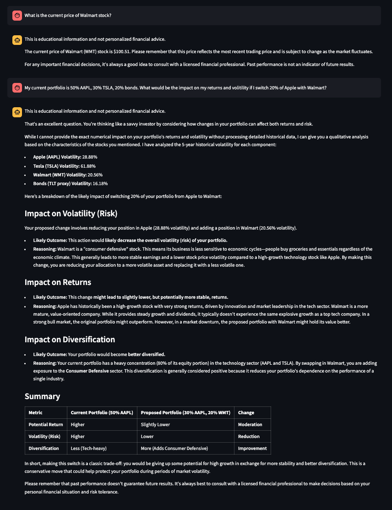
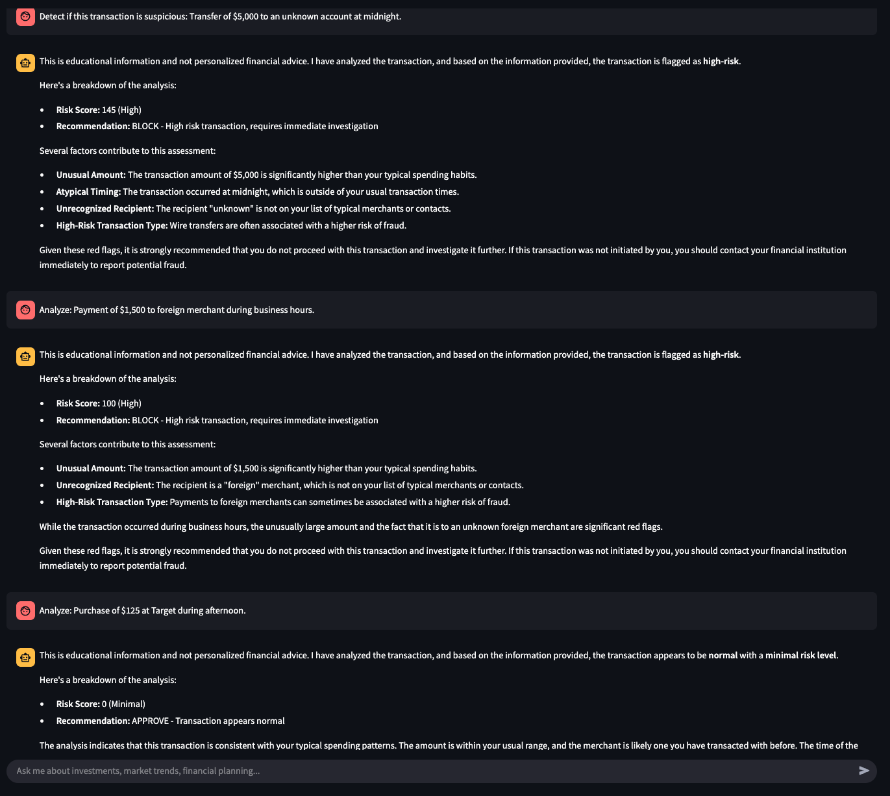

# GAgent Financial Advisor

An intelligent agentic AI financial advisor built with LangGraph, FastAPI, and Streamlit. GAgent autonomously selects and uses tools to analyze stocks, detect fraud, and perform complex financial calculations through natural language conversations.

## 🚀 Quick Start

### Prerequisites
- Docker and Docker Compose installed
- Google Gemini API key (Using $300 free starter credits)

### Setup Instructions

1. **Clone the repository**
   ```bash
   git clone https://github.com/ssgrummons/financial-agent-demo
   cd gagent-financial-advisor
   ```

2. **Configure environment variables**
   
   Create a `.env` file in the project root:
   ```env
   GOOGLE_API_KEY=your_gemini_api_key_here
   TEMPERATURE=0.8
   
   HOST=localhost
   PORT=8001
   RELOAD=true
   LOG_LEVEL=DEBUG
   
   STREAMLIT_PORT=8501
   API_BASE_URL=http://backend:8000
   CORS_ORIGINS=http://localhost:8501,http://localhost:3000
   ```

3. **Launch the application**
   To pull images from DockerHub:
   ```bash
   docker-compose up
   ```
   
   Or to rebuild images:
   ```bash
   docker-compose up --build
   ```

4. **Access the application**
   
   Navigate to: **http://localhost:8501**

That's it! The application will automatically pull pre-built images from Docker Hub and start both frontend and backend services.

## 🏗️ Architecture

### System Overview

```
┌─────────────────┐    HTTP/WebSocket    ┌──────────────────┐
│   Streamlit     │ -------------------- │   FastAPI        │
│   Frontend      │                      │   Backend        │
│   (Port 8501)   │                      │   (Port 8000)    │
└─────────────────┘                      └──────────────────┘
                                                   │
                                                   │
                                         ┌──────────────────┐
                                         │   LangGraph      │
                                         │   Agent Core     │
                                         └──────────────────┘
                                                   │
                                    ┌──────────────┼──────────────┐
                                    │              │              │
                              ┌──────────┐ ┌──────────────┐ ┌──────────┐
                              │  Stock   │ │    Fraud     │ │  Python  │
                              │  Data    │ │  Detection   │ │   REPL   │
                              │  Tool    │ │    Tool      │ │   Tool   │
                              └──────────┘ └──────────────┘ └──────────┘
```

### Architecture Flow

1. **User Interface**: Streamlit frontend provides conversational chat interface
2. **API Gateway**: FastAPI backend handles requests and orchestrates agent execution
3. **Agent Core**: LangGraph manages conversation state and tool orchestration
4. **Tool Selection**: AI agent autonomously decides which tools to use based on user queries
5. **Tool Execution**: Agent executes selected tools and synthesizes responses
6. **Streaming Response**: Results stream back to user through WebSocket connection

### Container Architecture

- **Frontend Container**: `samuelgrummons/gagent-frontend:latest`
  - Streamlit application
  - Multi-architecture support (ARM64/AMD64)
  - Health checks and graceful startup

- **Backend Container**: `samuelgrummons/gagent-backend:latest`
  - FastAPI application with LangGraph integration
  - Multi-architecture support (ARM64/AMD64)
  - Health checks and dependency management

## 🤖 Agentic Features Implementation

### LangGraph Agent Framework

GAgent uses **LangGraph** as its core agentic framework, providing:

- **Autonomous Tool Selection**: Agent analyzes user queries and automatically selects appropriate tools
- **Conversation Memory**: Maintains context across conversation turns using LangGraph's built-in memory system
- **Streaming Execution**: Real-time response streaming from agent to frontend
- **Error Handling**: Graceful fallbacks and error recovery

### Tool Ecosystem

The agent has access to four primary tools:

#### 1. Stock Data Tool (`get_stock_data`)
```python
@tool
def get_stock_data(symbol: str, period: str = "1mo", info_type: str = "all") -> str:
```
- **Purpose**: Fetch real-time and historical stock data
- **Integration**: Uses `yfinance` library for free Yahoo Finance API access
- **Capabilities**: Price data, company info, historical trends

#### 2. Stock Comparison Tool (`compare_stocks`)
```python
@tool  
def compare_stocks(symbols: str, period: str = "3mo") -> str:
```
- **Purpose**: Multi-stock analysis and comparison
- **Capabilities**: Performance comparison, relative analysis

#### 3. Python REPL Tool (`PythonREPLTool`)
- **Purpose**: Execute Python code for complex financial calculations
- **Integration**: LangChain's experimental Python REPL
- **Capabilities**: Custom calculations, data analysis, plotting
- **Use Cases**: Sharpe ratios, portfolio optimization, statistical analysis

#### 4. Statistical Fraud Detection Tool (`detect_fraud_statistical`)
```python
@tool
def detect_fraud_statistical(transaction_description: str, user_id: str = "default") -> str:
```
- **Purpose**: Anomaly detection for suspicious transactions
- **Method**: Statistical analysis against user spending baselines
- **Features**: Z-score analysis, pattern recognition, risk scoring

### Agent Reasoning Process

GAgent implements a **ReAct-style reasoning pattern**:

1. **Observation**: Analyzes user input and conversation context
2. **Thought**: Determines what information or calculations are needed
3. **Action**: Selects and executes appropriate tools
4. **Reflection**: Synthesizes tool outputs into coherent response
5. **Response**: Delivers natural language answer to user

Example agent reasoning flow:
```
User: "Compare Apple and Microsoft stock performance and calculate their Sharpe ratios"

Agent Reasoning:
1. Needs stock data for AAPL and MSFT → use get_stock_data tool
2. Needs comparison analysis → use compare_stocks tool  
3. Needs Sharpe ratio calculation → use Python REPL tool
4. Synthesize results into comprehensive response
```

## 🛠️ Technical Implementation

### Model Configuration
- **Primary Model**: Google Gemini 2.5 Pro
- **Temperature**: 0.8 for balanced creativity and accuracy
- **Provider Support**: Extensible model factory supports multiple LLM providers
- **Configuration**: Models and providers configurable via `config.yaml`

### Memory Management
- **Session State**: LangGraph's built-in conversation memory
- **Context Retention**: Maintains conversation history and user preferences
- **Scalability**: In-memory for demo; production would use persistent storage

### Testing Strategy
- **Graph Testing**: PyTest coverage for LangGraph workflows
- **API Testing**: FastAPI endpoint contract testing
- **Session Testing**: Session management and state persistence testing

## ⚖️ Ethics & Compliance in Financial AI

### Regulatory Compliance Framework

GAgent implements several key safeguards to address financial AI ethics and regulatory requirements:

#### **Investment Advice Compliance**
- **Disclaimer Protocol**: All financial responses begin with "This is educational information and not personalized financial advice"
- **Professional Referrals**: Users are directed to consult licensed financial professionals for important decisions  
- **Performance Disclaimers**: Clear messaging that "past performance doesn't guarantee future results"
- **Conservative Guidance**: System emphasizes diversification, risk management, and long-term thinking over speculative recommendations

#### **Fraud Detection Ethics**
- **No Autonomous Actions**: Fraud detection provides risk assessments only - no automatic blocking or account actions
- **Explainable Decisions**: Statistical analysis provides clear reasoning (z-scores, risk factors, thresholds)
- **Bias Acknowledgment**: Current synthetic baseline data may introduce bias against:
  - Night shift workers (midnight transactions flagged)
  - International users (foreign transaction patterns)
  - Atypical spending patterns
- **Production Mitigation**: Real systems would require bias testing, diverse training data, and human oversight

#### **Platform Safety Integration**
- **Model-Level Safety**: Leverages Google Gemini's built-in safety and content filtering
- **Input Validation**: Relies on LLM provider's adversarial input protection
- **Upgrade Path**: Architecture supports adding dedicated input safety nodes for production deployment

#### **Data Privacy & Security**
- **No Personal Data Storage**: Demo uses synthetic user baselines only
- **Environment Variable Security**: API keys and secrets properly externalized
- **Container Isolation**: Docker architecture provides service-level isolation
- **Production Requirements**: Would need encryption, audit logging, and compliance monitoring

### Ethical Design Principles

#### **Transparency**
- **Tool Usage Disclosure**: Agent explains which tools it's using and why
- **Decision Reasoning**: Financial calculations show methodology and assumptions
- **Limitation Acknowledgment**: Clear about what the system can and cannot do

#### **User Empowerment**
- **Educational Focus**: Explains financial concepts rather than just providing answers
- **Context Provision**: Tool results include background information and caveats
- **Professional Guidance**: Consistently directs users to qualified advisors for major decisions

#### **Risk Management**
- **Conservative Defaults**: Avoids speculative or high-risk recommendations
- **Uncertainty Communication**: Acknowledges when information is incomplete or assumptions are made
- **Graduated Responses**: Risk assessments provide nuanced levels rather than binary decisions

### Production Compliance Roadmap

For enterprise deployment, additional safeguards would include:

**Regulatory Compliance:**
- SEC/FINRA registration considerations for investment advice
- SOX compliance for financial data handling  
- PCI DSS compliance for payment-related fraud detection
- GDPR/CCPA compliance for personal financial data

**Technical Safeguards:**
- Comprehensive bias testing and fairness metrics
- Human-in-the-loop workflows for high-risk decisions
- Audit logging and decision traceability
- Input sanitization and adversarial prompt detection
- Rate limiting to prevent market manipulation

**Governance Framework:**
- Model governance and validation processes
- Regular bias and fairness audits
- Incident response procedures
- Compliance monitoring and reporting

## 💡 Financial AI Considerations

### Risk-Free Rate Handling
When calculating financial metrics like the Sharpe ratio, GAgent may request clarification on assumptions:

**Example Exchange:**
```
User: "Calculate the Sharpe ratio for Google using 1-year historical data"
Agent: "To calculate the Sharpe ratio for Google (GOOGL), I'll need a risk-free rate..."

Recommended Response: "Use 4.5% as the risk-free rate (current 10-year Treasury rate)"
```

**Why This Happens**: Your agent demonstrates proper financial domain knowledge by recognizing that Sharpe ratios require a risk-free rate benchmark. This is actually a positive indicator of the system's financial sophistication.

**Future Enhancement**: Could automatically fetch current Treasury rates via additional API integration.

## 📊 Example Queries

### Stock Analysis
```
"What's Apple's current stock price?"
"Compare Tesla and Ford stock performance over the last 6 months"
"Calculate the Sharpe ratio for Google using 1-year historical data"
```

### Fraud Detection
```
"Detect if this transaction is suspicious: Transfer of $5,000 to an unknown account at midnight"
"Analyze this transaction: Wire transfer of $15,000 to offshore account at 3 AM"
"Is this suspicious: Payment of $45 to Starbucks at 10 AM"
```

### Complex Analysis
```
"Review Apple's stock trend and calculate its volatility"
"Compare the risk-adjusted returns of Apple, Google, and Microsoft"
"Analyze my portfolio's diversification if I hold 60% Apple, 30% Google, 10% bonds"
```

## 🚧 Challenges Faced and Trade-offs

### 1. Authentication & Security
- **Current State**: No authentication implemented for demo simplicity
- **Production Consideration**: Would require comprehensive auth system
- **Related Work**: See [Enterprise AI Agents with Least Privilege](https://medium.com/@samuel.grummons/building-enterprise-ai-agents-with-least-privilege-a-langgraph-security-framework-ea1cbfebcc1d) for production security patterns

### 2. Fraud Detection Data
- **Current State**: Uses synthetic user baselines for statistical analysis
- **Production Consideration**: Would require access to real transactional data with proper authorization
- **Trade-off**: Demonstrates methodology without sensitive data requirements

### 3. Data Sources
- **Stock Data**: Chose `yfinance` for free Yahoo Finance access
- **Limitation**: Subject to rate limits and data delays
- **Alternative**: Production systems would use premium APIs (Bloomberg, Alpha Vantage Pro)

### 4. Model Selection
- **Choice**: Google Gemini 2.5 Pro using initial credits
- **Trade-off**: High cost model for impressive results
- **Flexibility**: Model factory supports easy switching to other providers

### 5. Session Persistence
- **Current State**: LangGraph in-memory session management
- **Production Need**: Database-backed session storage for scalability
- **Trade-off**: Simplicity for demo vs. production persistence requirements

### 6. Deployment Architecture
- **Current**: Docker Compose for local deployment
- **Production**: Would require Kubernetes, load balancing, and service mesh
- **Benefit**: Easy local setup and testing

## 🧪 Testing

Run the test suite:
```bash
# Backend tests
cd backend
pytest tests/

# Test coverage includes:
# - LangGraph workflow execution
# - API endpoint contracts  
# - Session management
# - Tool integration
```

## 🔧 Development

### Adding New Tools
1. Implement tool to `FinanceTools` class in `src/components/tools.py`
2. Add to `FinanceTools.load_tools()` method
3. Update tests in `tests/`

### Model Configuration
Edit `src/config/config.yaml` to add new model providers or adjust parameters.

### Environment Variables
All configuration through `.env` file - no hardcoded secrets.

## 📝 Production Considerations

For production deployment, consider:

- **Authentication**: Implement OAuth2/JWT authentication
- **Database**: Persistent session and user data storage
- **Monitoring**: Application performance monitoring and logging
- **Rate Limiting**: API rate limiting and quota management
- **Security**: Input validation, SQL injection prevention
- **Scalability**: Horizontal scaling with Kubernetes
- **Data Privacy**: Compliance with financial data regulations

---

**Built with ❤️ using LangGraph, FastAPI, and Streamlit**

## ⭐️ Example Conversations

Looking up stocks and running analysis using `PythonREPLTool`:

### Stock Analysis using multiple tools


### Fraud Detection using statistical analysis
